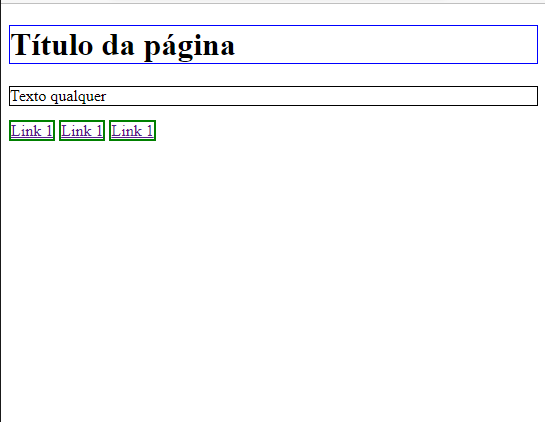

# Design Web
Prof. Romerito Campos

---

##  Plano de Aula

**Objetivo:** apresentar o uso da propriedade display para  construção de layouts.

**Conteúdo**
- display: `inline`, `block` e `inline-block`
- display: `table`
- multi-columns layout
- Float: `left` e `right`

---

## Fluxo Normal

- Os elementos HTML são desenhados no viewport de acordo com o fluxo normal.
  
- Nessa situação, a propriedade display é utilizada de acordo com o padrão de cada elemento: *inline* ou *block*

- Os elementos inline são chamados de **elementos de nível inline** e os elementos de block são chamados de **elementos de nível de block**

---

## Fluxo Normal

Elementos HTML desenhados de acordo com o fluxo padrão. 

Os elementos `h1` e `p` são elementos de nível de bloco. O elemento `a` é um elemento de nível inline. 

```html
<body>
    <h1>Título da página</h1>
    <p>Texto qualquer</p>
    <a href="">Link 1</a>
    <a href="">Link 1</a>
    <a href="">Link 1</a>
</body>
```

--- 

 


---
## Fluxo Normal

- É possível modificar a propriedade padrão de cada elemento html.
  
- Isso permite mais flexibidade para construir layouts.
  
- O código abaixo aplica em qualquer âncora (anchor) o `display: block` quando a classe `.block` é usada.


```css
    /* Código CSS */
    .block {
        display: block
    }
```

```html
<body>
    <h1>Título da página</h1>
    <p>Texto qualquer</p>
    <a class="block" href="">Link 1</a>
    <a class="block" href="">Link 1</a>
    <a class="block" href="">Link 1</a>
</body>
```

---
<style>
    figure {
        border: 5px solid black;
    }
</style>


---
## Fluxo Normal e Layouts

- É possível utilizar fluxo normal de desenho dos elementos para gerar um layout de uma aplicação

- Obviamente, alguns problemas surgem como redimencionamento dos elementos e dificuldades de alinhamento dos elementos.

- Vejamos como configurar um layout simples com os seguintes elementos: `<header>`, `<asise>`, `<section>` e `<footer>`.


<!-- Verical align tag

https://www.w3schools.com/css/css_inline-block.asp


https://medium.com/collabcode/pare-de-chutar-e-aprenda-como-funciona-o-display-inline-block-4e6cba2f19d4

https://www.treinaweb.com.br/blog/css-float-vs-inline-block-qual-usar-em-meus-layouts -->

---


--- 

## Fluxo Normal e Layouts

- O design apresentado no slide anterior foi construído com base no uso da propriedade `display` e fluxo normal de desenho dos elementos.

- Dois pontos imporntantes no css deste exemplos são destantes:

```css
section {
    margin-left: -4px;
    vertical-align: top;    
}
```

No exemplo prático, veremos que estas duas propridades não sendo definidas na regra. Fazem com que a seção fique desalinhada em relação ao aside.

--- 

## Fluxo Normal

- Note que usamos as propriedades `inline-block` e `block` aplicados a alguns elementos.

- Quando definimos um elemento com `display: inline` não podemos alterar a altura (height) e largura (width) deste elemento. 
  
- Mas tem situações que precisamos mudar o elemento de `display: block` para `display: inline`.

- Nessa situação, aplica-se o `display: inline`

--- 

## display: table (legado)

- Legado

- Situações de uso -  browsers antigos que não suportam `flex` e `grid`.

- Usa-se a propriedade `display:table` e depois aplica `display: table-row` e `display: table-cell`. 
  
- Desse modo, os elementos vão se comportar como uma tabela HTML.

---

## display: table (legado)

- É possível usar tanto a marcação HTML quanto as regras CSS para definir layouts utilizando tabelas.

- Com a marcação HTML, as tags `table,th,tr,td`. Por outro lado, com CSS podemos utilizar a propriedade `display: table` desenhando elementos como tabela.

- No exemplo, a seguir vamos utilizar o seguinte display para os elementos:
  - `display: table` - `display: table-row`  - `display: table-cell`

---


---

## multi-column layout

- É possível aplicar a um container um design com múltiplas colunas. Neste caso, não alteramos a propriedade display.


- Podemos utilizar a propriedade:
  - `columns: 3`: que aplicará uma divisão do eleemento container em 3 colunas;
  - `column-count`: indica o número fixo de colunas;
  - `column-width`: indica a largura da coluna.
  
- Vejamos um exemplo onde podemos aplicar o layout com múltiplas colunas em container.

---


---

## `float: left` e `float: right`

- A propriedade `float` faz com que o elemento saiam do fluxo normal.

- Esta propriedade permite que o alinhamento dos elementos os agrupem de maneira que um layout possa ser concluído

- Aplicar float terá praticamente o mesmo efeito de usar `display: block`, `display: inline-block` e `display: inline`.

- Vejamos mais exemplos.

---

## Referências


AUTOR. *CSS Layout*. Mozilla Developer Network, 2021. Disponível em: https://developer.mozilla.org/pt-BR/docs/Learn/CSS/CSS_layout/Introduction#the_display_property. Acesso em: 05/09/2023.

Mozilla Developer Network (MDN). "CSS Layout - Fluxo Normal." Mozilla Developer Network, 2023. Disponível em: https://developer.mozilla.org/pt-BR/docs/Learn/CSS/CSS_layout/Normal_Flow. Acesso em: 05/09/2023.

Bruno, Marco. Pare de chutar e aprenda como funciona o display: inline-block. *Medium*, Disponível em: https://medium.com/collabcode/pare-de-chutar-e-aprenda-como-funciona-o-display-inline-block-4e6cba2f19d4. Acesso em: 05/09/2023.

