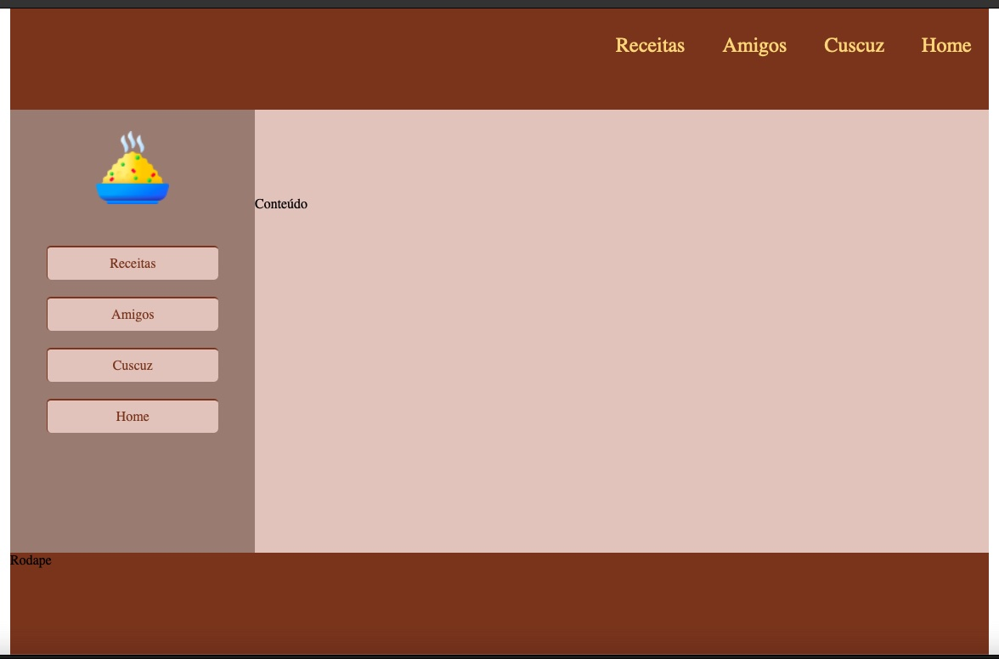
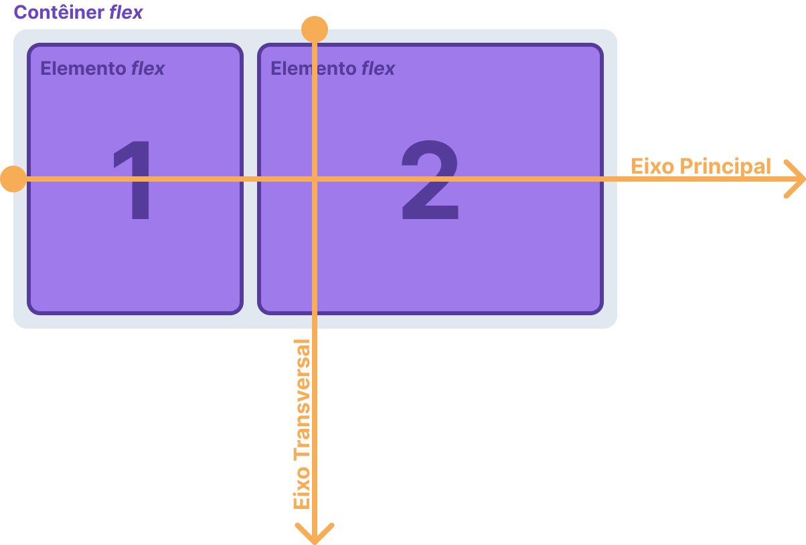

# Design Web
Prof. Romerito Campos

---

# Plano de Aula

- Objetivo: compreender os elementos básicos do Flexbox

- Conteúdo programático
  - **Container flex**
  - **Item flex**
  - Propriedades sobre **Container Flex**
    - flex-direction
    - flex-wrap
    - justify-Content

---

# Problema Abordado



---

<style scoped>
section {
    display: flex;
    flex-direction: column;
    justify-content: center;
    align-items:center;
}

h1 {
    text-align:center;
}
</style>

# Container Flex

---

# Container Flex

- A propridade que permite definir um elemento como container flex é `display: flex`.
  
- Também é possível utilizar `display: inline-flex`.


- O container flex vai ser comportar como elemento de bloco ou inline-bloco de acordo com a propriedade display mencionada acima.

---

# Container Flex

**Exemplo 1**
```css
/* Exemplo 1 */
.div {
    display: flex;
    border: 1px solid black;
}
```
<br>

Neste exemplo, temos duas divs definidas como container flex. Entretanto, são desenhadas como elementos de blocos.

[Exemplo 1](http://localhost:8000/exemplo01.html)

---

# Container Flex

**Exemplo 2**
```css
/* Exemplo 2 */
.div {
    display: inline-flex;
    border: 1px solid black;
}
```
<br>

Observe no link abaixo que os elementos se comportam como elementos inline. Entretanto, são container flex

[Exemplo 2](http://localhost:8000/exemplo02.html)

---
# Container Flex

- É importante notar dos exemplos anteriores que ao definirmos a propriedade `display-flex`, estamos indicando que **dentro** do container os elementos terão comportamento de **itens-flex**.

- Há um conjunto de propriedades ao nível de container flex e também ao nível de item flex.


- O flexbox permite construir layout de forma direcional sobre dois eiso: **main-axis** e **cross-axis**

---

# Container Flex - Eixos

- Os itens flex são acomodados no container de modo direcional. Isso significa que eles são acomodados em uma única dimensão horizontal ou vertical.

- Há dois eixos que orientação o desenho dos itens: **main-axis** e **cross-axis** (Eixo principal e eixo perpendicular).

- Por padrão, o desenho dos elementos começa da esquerda para direita do topo para baixo. 

---



---

<style scoped>
section {
    display: flex;
    flex-direction: column;
    justify-content: center;
    align-items:center;
}

h1 {
    text-align:center;
}
</style>

# Propriedade flex-direction

---
# Propriedade flex-direction

- Este propriedade permite controlar a direção do eixo-principal, consequentemente do eixo perpendicular.

```css
.div {
    display: flex;
    flex-direction: row;
}
```
```css
.div {
    display: flex;
    flex-direction: row-reverse;
}
```

```css
.div {
    display: flex;
    flex-direction: column;
}
```
```css
.div {
    display: flex;
    flex-direction: column-reverse;
}
```

---

# Propriedade flex-direction: row

[Exemplo 3](http://localhost:8000/exemplo03.html) - `flex-direction: row` (**Padrão**)
<br>

```css
div {            
    border: 1px solid black;
}
.container {            
    display: flex;            
    height: 100px;
    width: 600px;            
    padding: 20px;
} 
```

```css
<div class="container">
    <div> Texxto 1</div>
    <div> Texxto 2</div>
    <div> Texxto 3</div>
    <div> Texxto 4</div>
</div>
```
---

# Propriedade flex-direction: row-reverse

[Exemplo 4](http://localhost:8000/exemplo04.html) - `flex-direction: row-reverse`
<br>

```css
div {            
    border: 1px solid black;
}
.container {            
    display: flex; 
    flex-direction: row-reverse          
    height: 100px;
    width: 600px;            
    padding: 20px;
} 
```

```css
<div class="container">
    <div> Texxto 1</div>
    <div> Texxto 2</div>
    <div> Texxto 3</div>
    <div> Texxto 4</div>
</div>
```
---

# Propriedade flex-direction: column

[Exemplo 5](http://localhost:8000/exemplo05.html) - `flex-direction: column`
<br>

```css
div {            
    border: 1px solid black;
}
.container {            
    display: flex; 
    flex-direction: column;         
    height: 100px;
    width: 600px;            
    padding: 20px;
} 
```

```css
<div class="container">
    <div> Texxto 1</div>
    <div> Texxto 2</div>
    <div> Texxto 3</div>
    <div> Texxto 4</div>
</div>
```
---

# Propriedade flex-direction: column-reverse

[Exemplo 6](http://localhost:8000/exemplo06.html) - `flex-direction: column-reverse`
<br>

```css
div {            
    border: 1px solid black;
}
.container {            
    display: flex; 
    flex-direction: column-reverse;         
    height: 100px;
    width: 600px;            
    padding: 20px;
} 
```

```css
<div class="container">
    <div> Texxto 1</div>
    <div> Texxto 2</div>
    <div> Texxto 3</div>
    <div> Texxto 4</div>
</div>
```
---

# Propriedade flex-direction

- Duas definições importantes em relação ao eixo principal são:
  - `main-start`: ponto extremo a esquerda (padrão)
  - `main-end`: ponto extremo a direita (padrão)


- O main-start e o main-end mudam quando alteramos a propriedade `flex-direction`.

- Por exemplo: para `flex-direction: row-reverse`. o `main-start` é o ponto extremo a direta.

---

# Propriedade flex-wrap

- O que acontece quando os itens de um container não cabem dentro dele?

- **Esta propriedade permite controle sobre situações relacionadas a pergunta anterior**.

- Veja o exemplo abaixo:

[Exemplo 7 ](http://localhost:8000/exemplo07.html)

--- 
<style scoped>
section {
    display: flex;
    flex-direction: column;
    justify-content: center;
    align-items:center;
}

h1 {
    text-align:center;
}
</style>

# Propriedade flex-wrap

---

# Propriedade flex-wrap

- O código do exemplo anterior é o seguinte:

```css
.container1, .box{
    border: 1px solid black;            
}        
.container1 {
    display: flex;             
    width: 400px;
    height: 300px;            
}
.box {                        
    padding: 5px 10px;
    margin: 5px 10px;
}
```

```html
<p>Container 1 - row</p>
<p>Abaixo os boxs estão causando overflow</p>
<div class="container1">
    <div class="box">Box1</div>
    <div class="box">Box2</div>
    <div class="box">Box3</div>
    <div class="box">Box4</div>
    <div class="box">Box5</div>
    <div class="box">Box6</div>
    <div class="box">Box7</div>
    <div class="box">Box8</div>
    <div class="box">Box9</div>
    <div class="box">Box10</div>
</div>
```

--- 
# Propriedade flex-wrap

- Esta propriedade suporta três valores:
  - `flex-wrap: nowrap`(padrão), 
  - `flex-wrap: wrap`
  - `flex-wrap: wrap-reverse`


- Correção do problema do Exemplo 7:

[Exemplo 08](http://localhost:8000/exemplo08.html)

---

# Propriedade flex-wrap

No exemplo anterior vimos:

- `flex-wrap`: vair criar novas linhas quando for `flex-direction: row` e vai criar novas colunas quando `flex-direction:column`.


- Cada linha terá a altura do maior elemento que estiver nela.


- Para colunas (`flex-direction: column`), cada columna terá a largura do elemento mais largo (se não especificar largura, preenche a coluna inteira): 
  - [Exemplo 09](http://localhost:8000/exemplo09.html)


--- 

# Propriedade flex-wrap

- Outra opçao é utilizar a propriedade `flex-wrap: wrap-reverse`.

**flex-direction: row**
[Exemplo 10](http://localhost:8000/exemplo10.html)

**flex-direction: column**
[Exemplo 11](http://localhost:8000/exemplo11.html)

---

<style scoped>
section {
    display: flex;
    flex-direction: column;
    justify-content: center;
    align-items:center;
}

h1 {
    text-align:center;
}
</style>

# Uso do espaço no Container Flex

`justify-content` e `align-items`

---

# Propriedade justify-content

- permite controle sobre o uso do espaço no eixo `main`(principal).

- há 5 opções de valores:
  - flex-start (padrão)
  - flex-end
  - space-between
  - space-around
  - center

---
# Propriedade justify-content

- flex-end : [Exemplo 12](http://localhost:8000/exemplo12.html)

```css
.container {
    display: flex;
    justify-content: flex-end;
    border: 1px solid black;
    padding: 10px 20px;
}
.box {
    border: 1px solid black;
    padding: 10px 20px;
}
```

```html
<div class="container">
    <div class="box">
        Texto 1
    </div>
    <div class="box">
        Texto 2
    </div>
    <div class="box">
        Texto 3
    </div>
</div>
```

---

# Propriedade justify-content
- space-between: [Exemplo 13](http://localhost:8000/exemplo13.html)

```css
.container {
    display: flex;
    justify-content: space-between;
    border: 1px solid black;
    padding: 10px 20px;
}
.box {
    border: 1px solid black;
    padding: 10px 20px;
}
```
```html
<div class="container">
    <div class="box">
        Texto 1
    </div>
    <div class="box">
        Texto 2
    </div>
    <div class="box">
        Texto 3
    </div>
</div>
```

---
# Propriedade justify-content

- space-around : [Exemplo 14](http://localhost:8000/exemplo14.html)  

```css
.container {
    display: flex;
    justify-content: space-around;
    border: 1px solid black;
    padding: 10px 20px;
}
.box {
    border: 1px solid black;
    padding: 10px 20px;
}
```

```html
<div class="container">
    <div class="box">
        Texto 1
    </div>
    <div class="box">
        Texto 2
    </div>
    <div class="box">
        Texto 3
    </div>
</div>
```

---

# Propriedade justify-content
- center : [Exemplo 15](http://localhost:8000/exemplo15.html)


```css
.container {
    display: flex;
    justify-content: center;
    border: 1px solid black;
    padding: 10px 20px;
}
.box {
    border: 1px solid black;
    padding: 10px 20px;
}
```

```html 
<div class="container">
    <div class="box">
        Texto 1
    </div>
    <div class="box">
        Texto 2
    </div>
    <div class="box">
        Texto 3
    </div>
</div>
```

---

# Referências
